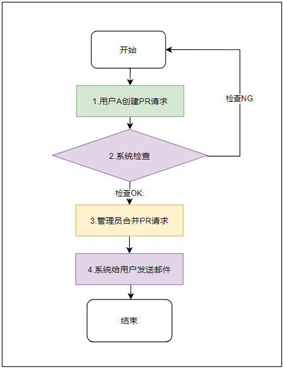
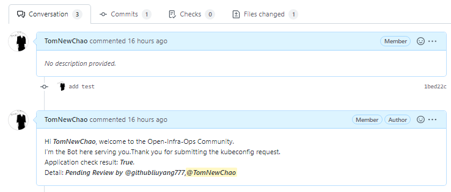
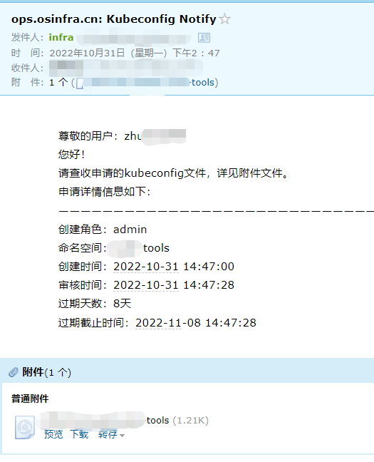

# kubeconfig-interact

## 1.功能

​	通过向本项目提交pr，实现kubeconfig的自动生成，并通过邮件进行分发。

## 2.申请流程

### 1.申请流程

具体的流程步骤在第2章的`申请流程详解`中会着重阐述。

- 用户需要完成步骤1。
- 管理员需要完成步骤3。
- 系统完成步骤2, 4。

### 2.申请流程详解

#### 1. 用户创建PR请求

+ 用户A需要fork本仓库，在对应社区下的文件夹创建yaml文件

  + yaml文件名称规范为：日期+用户+服务名，例如以下内容：

    ~~~bash
    20221011_zhu_infra-scan-tools
    ~~~

  + yaml文件内容参考模板文件：详细见：[20221011_zhu_infra-scan-tools.yaml](https://github.com/Open-Infra-Ops/kubeconfig-interact/blob/main/doc/20221011_zhu_infra-scan-tools.yaml)

    ~~~yaml
    ServiceName: infra-scan-tools  # 申请kubeconfig的服务名称，服务名称模板见：doc/ServiceName.txt
    UserName: zhuchao99    # 用户名称；限制：由数字、小写字母组成，不能含有特殊字符，最长长度为20，不能包含大写字母。
    Email: ****@163.com   # 用于接受kubeconfig的邮件
    Role: admin/developer/viewer # 申请角色；admin为拥有所有权限，developer为开发者权限，进入容器权限， viewer只能查看日志 
    TimeLimit: 7       # 时间限制；单位：天；限制：必须为数字类型，不能小于0。
    ~~~

  + ServiceName详细见： [ServiceName](https://github.com/Open-Infra-Ops/kubeconfig-interact/blob/main/doc/ServiceName.txt)

+ 将yaml文件填写完成后，向FORK仓库提交后，需要再向本仓库`https://github.com/Open-Infra-Ops/kubeconfig-interact`创建PR请求。

#### 2.系统检查

+ 用户提交PR后，系统会对PR进行内容检查。

+ 检查成功后如下图所示：

  

#### 3.管理员合并PR请求

+ 管理员根据系统检查结果，申请人属实等情况，自行判断进行PR合入。
+ 管理员可以在PR中评论`\check`再次进行系统检查。

#### 4.系统给用户发送邮件

+ 合并PR成功后系统会向申请人发送邮件，而申请的KubeConfig文件则在邮件附件中； 邮件可能会存在垃圾邮箱中，请注意查看，其大体内容如下：

  

+ kubeconfig的使用

  ~~~bash
  1.安装kubelet
  详细参考：https://kubernetes.io/zh-cn/docs/tasks/tools/install-kubectl-windows/
  
  2.使用kubeconfig
  # 查看pod
  kubectl get pod -n 命名空间 --kubeconfig 申请的config文件
  kubectl get pod -n ****-tools --kubeconfig ****-tools
  
  # 进入pod
  kubectl exec -it ***-tools-**** /bin/bash -n ****-tools --kubeconfig ****-tools
  ***-tools-**** : 查看的具体pod
  
  # 查看pod的日志
  kubectl logs ***-tools-**** -n ****-tools --kubeconfig ****-tools
  ~~~

## 3.注意事项

1.隐私声明： 用户填写的yaml内容，本平台只能用于维护和管理用户的kubeconfig申请使用，不会挪作他用。

2.PR请求中的文件只能新增，不能修改， 详细解释：不能对之前创建的还在有效期的文件进行修改。

3.用户对相同的服务提交两次pr， 只能以最后发送的kubeconfig有效。详细解释：用户提交一次PR后，已经申请对该服务的权限，并在有效期内再次对相同的服务提交PR， 则新创建的kubeconfig有效，而之前的生成的kubeconfig失效。

4.允许用户一次提交PR中包含对多个服务的权限申请。

